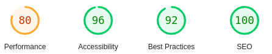

# 🕶 HTML5 e CSS3 Essentials

<!-- ABOUT THE PROJECT -->
## Sobre o projeto
Projeto prático HTML5 e CSS3 Essentials desenvolvido no curso da UpInside Treinamentos com a finalidade de aprender HTML5 Semântico, seguindo as boas patricas da [WHATWG community](https://whatwg.org)

(<a href="#-html5-e-css3-essentials">volta ao topo</a>)

## Construído com
- HTML5 Semântico
- CSS3
- jQuery 3
- JavaScript

(<a href="#-html5-e-css3-essentials">volta ao topo</a>)

<!-- Google Lighthouse -->
## Google Lighthouse

(<a href="#readme">volta ao topo</a>)

<!-- LICENSE -->
## License

Distribuído sob a licença GNU General Public License v3.0. Veja `LICENSE.txt` para mais informações.

(<a href="#-html5-e-css3-essentials">volta ao topo</a>)

<!-- CONTACT -->
## Contato

Walisson Aguirra - walisson.aguirra@gmail.com

Link do projeto: [https://github.com/walissonaguirra/html5-e-css3-essentials](https://github.com/walissonaguirra/html5-e-css3-essentials)

(<a href="#-html5-e-css3-essentials">volta ao topo</a>)

